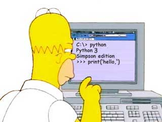

# 第一个Python程序

在正式编写第一个Python程序前，我们先复习一下什么是命令行模式和Python交互模式。

### 命令行模式

在Windows开始菜单选择“命令提示符”，就进入到命令行模式，它的提示符类似`C:\>`：

```ascii
┌────────────────────────────────────────────────────────┐
│Command Prompt                                    - □ x │
├────────────────────────────────────────────────────────┤
│Microsoft Windows [Version 10.0.0]                      │
│(c) 2015 Microsoft Corporation. All rights reserved.    │
│                                                        │
│C:\> _                                                  │
│                                                        │
└────────────────────────────────────────────────────────┘
```

### Python交互模式

在命令行模式下敲命令`python`，就看到类似如下的一堆文本输出，然后就进入到Python交互模式，它的提示符是`>>>`。

```ascii
┌────────────────────────────────────────────────────────┐
│Command Prompt - python                           - □ x │
├────────────────────────────────────────────────────────┤
│Microsoft Windows [Version 10.0.0]                      │
│(c) 2015 Microsoft Corporation. All rights reserved.    │
│                                                        │
│C:\> python                                             │
│Python 3.x ... on win32                                 │
│Type "help", ... for more information.                  │
│>>> _                                                   │
│                                                        │
└────────────────────────────────────────────────────────┘
```

在Python交互模式下输入`exit()`并回车，就退出了Python交互模式，并回到命令行模式：

```ascii
┌────────────────────────────────────────────────────────┐
│Command Prompt                                    - □ x │
├────────────────────────────────────────────────────────┤
│Microsoft Windows [Version 10.0.0]                      │
│(c) 2015 Microsoft Corporation. All rights reserved.    │
│                                                        │
│C:\> python                                             │
│Python 3.x ... on win32                                 │
│Type "help", ... for more information.                  │
│>>> exit()                                              │
│                                                        │
│C:\> _                                                  │
│                                                        │
└────────────────────────────────────────────────────────┘
```

也可以直接通过开始菜单选择`Python (command line)`菜单项，*直接进入*Python交互模式，但是输入`exit()`后窗口会直接关闭，不会回到命令行模式。

了解了如何启动和退出Python的交互模式，我们就可以正式开始编写Python代码了。

在写代码之前，请*千万不要*用“复制”-“粘贴”把代码从页面粘贴到你自己的电脑上。写程序也讲究一个感觉，你需要一个字母一个字母地把代码自己敲进去，在敲代码的过程中，初学者经常会敲错代码：拼写不对，大小写不对，混用中英文标点，混用空格和Tab键，所以，你需要仔细地检查、对照，才能以最快的速度掌握如何写程序。



在交互模式的提示符`>>>`下，直接输入代码，按回车，就可以立刻得到代码执行结果。现在，试试输入`100+200`，看看计算结果是不是300：

```bash
>>> 100+200
300
```

很简单吧，任何有效的数学计算都可以算出来。

如果要让Python打印出指定的文字，可以用`print()`函数，然后把希望打印的文字用单引号或者双引号括起来，但不能混用单引号和双引号：

```bash
>>> print('hello, world')
hello, world
```

这种用单引号或者双引号括起来的文本在程序中叫字符串，今后我们还会经常遇到。

最后，用`exit()`退出Python，我们的第一个Python程序完成！唯一的缺憾是没有保存下来，下次运行时还要再输入一遍代码。

### 命令行模式和Python交互模式

请注意区分命令行模式和Python交互模式。

在命令行模式下，可以执行`python`进入Python交互式环境，也可以执行`python hello.py`运行一个`.py`文件。

执行一个`.py`文件*只能*在命令行模式执行。如果敲一个命令`python hello.py`，看到如下错误：

```ascii
┌────────────────────────────────────────────────────────┐
│Command Prompt                                    _ □ x │
├────────────────────────────────────────────────────────┤
│Microsoft Windows [Version 10.0.0]                      │
│(c) 2015 Microsoft Corporation. All rights reserved.    │
│                                                        │
│C:\> python hello.py                                    │
│python: can't open file 'hello.py': [Errno 2] No such   │
│file or directory                                       │
│                                                        │
└────────────────────────────────────────────────────────┘
```

错误提示`No such file or directory`说明这个`hello.py`在当前目录*找不到*，必须先把当前目录切换到`hello.py`所在的目录下，才能正常执行：

```ascii
┌────────────────────────────────────────────────────────┐
│Command Prompt                                    _ □ x │
├────────────────────────────────────────────────────────┤
│Microsoft Windows [Version 10.0.0]                      │
│(c) 2015 Microsoft Corporation. All rights reserved.    │
│                                                        │
│C:\> cd work                                            │
│                                                        │
│C:\work> python hello.py                                │
│Hello, world!                                           │
│                                                        │
└────────────────────────────────────────────────────────┘
```

此外，在命令行模式运行`.py`文件和在Python交互式环境下直接运行Python代码有所不同。Python交互式环境会把每一行Python代码的结果自动打印出来，但是，直接运行Python代码却不会。

例如，在Python交互式环境下，输入：

```bash
>>> 100 + 200 + 300
600
```

直接可以看到结果`600`。

但是，写一个`calc.py`的文件，内容如下：

```python
100 + 200 + 300
```

然后在命令行模式下执行：

```bash
C:\work>python calc.py
```

发现什么输出都没有。

这是正常的。想要输出结果，必须自己用`print()`打印出来。把`calc.py`改造一下：

```python
print(100 + 200 + 300)
```

再执行，就可以看到结果：

```bash
C:\work>python calc.py
600
```

最后，Python交互模式的代码是输入一行，执行一行，而命令行模式下直接运行`.py`文件是一次性执行该文件内的所有代码。可见，Python交互模式主要是为了调试Python代码用的，也便于初学者学习，它*不是*正式运行Python代码的环境！

```question type=radio
在Python交互模式下输入 2**10 你会得到：
----
    20
    210
    2**10
[x] 1024
```

### SyntaxError

如果遇到`SyntaxError`，表示输入的Python代码有语法错误，最常见的一种语法错误是使用了中文标点，例如使用了中文括号`（`和`）`：

```bash
>>> print（'hello'）
  File "<stdin>", line 1
    print（'hello'）
         ^
SyntaxError: invalid character '（' (U+FF08)
```

或者使用了中文引号`“`和`”`：

```bash
>>> print(“hello”)
  File "<stdin>", line 1
    print(“hello”)
          ^
SyntaxError: invalid character '“' (U+201C)
```

出错时，务必阅读错误原因。对于上述`SyntaxError`，解释器会明确指出错误原因是无法识别的字符`“`：`invalid character '“'`。

### 小结

在Python交互式模式下，可以直接输入代码，然后执行，并立刻得到结果；

在命令行模式下，可以直接运行`.py`文件。
